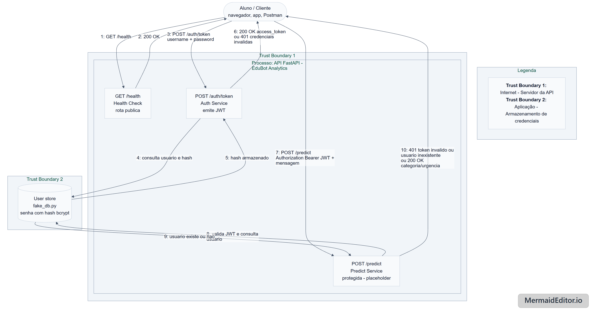

# EduBot Analytics - Suporte Acadêmico Universitário

## Sobre o projeto

Este repositório contém o desenvolvimento do projeto **EduBot Analytics**, uma gente de IA para suporte acadêmico universitário, atendendo pedidos de matrícula, trancamento de disciplinas e consulta de notas desenvolvido como parte da disciplina **Projeto de Bloco: Análise e Segurança de Agentes de IA**.

Este repositório reúne a primeira entrega do projeto (TP1), com foco na escolha e EDA do dataset, estrutura base da API com autenticação JWT, e modelagem inicial de ameaças (DFD + análise CIA).

## Disciplina e equipe

| **Disciplina** | Projeto de Bloco: Análise e Segurança de Agentes de IA |
| --- | --- |
| **Professor(a)** | Ricardo Pires Mesquita |
| **Aluno A - Dados/IA** | Maitê Mota Belo de Souza Silva |
| **Aluno B - Infra/Sec** | Patricia Dias Rodrigues |

## Estrutura do repositório

```
├── api/        # API FastAPI (Infra/Sec), autenticação JWT, rotas base
├── eda/        # Notebook de EDA e dataset (Dados/IA)
│ └── data/     # Arquivos do dataset usado na análise
├── dfd/        # Diagrama de fluxo de dados (DFD) e análise CIA
└── README.md   # Este arquivo
```

## API (Infra/Sec)

### O que foi implementado

- Estrutura modular em `api/app/`: `routers/` (rotas), `models/` (schemas Pydantic), `core/` (configuração e segurança), `db/` (base de usuários, hoje em memória).
- Autenticação **JWT** com `OAuth2PasswordBearer` (`python-jose` para o token, `passlib`/`bcrypt` para hashing de senha).
- 3 rotas mínimas exigidas pelo TP1:
  - `GET /health` - pública, não exige autenticação.
  - `POST /auth/token` - login (usuário/senha via form OAuth2), retorna um JWT.
  - `POST /predict` - protegida por JWT; retorna **401** sem token e **200** com token válido. A resposta ainda é um **placeholder**: a classificação real de categoria (burocrático/pedagógico) e urgência será implementada quando o modelo/agente do EduBot Analytics existir, em etapas futuras do bloco.

### Estrutura do código

```
api/
├── app/
│ ├── main.py               # cria o app FastAPI e registra as rotas
│ ├── core/
│ │ ├── config.py           # settings (lidas de variáveis de ambiente)
│ │ ├── hashing.py          # hashing de senha (bcrypt)
│ │ └── security.py         # criação/validação de JWT, dependency de auth
│ ├── models/
│ │ └── schemas.py          # modelos Pydantic (Token, PredictRequest, etc.)
│ ├── routers/
│ │ ├── health.py           # GET /health
│ │ ├── auth.py             # POST /auth/token
│ │ └── predict.py          # POST /predict
│ └── db/
│ └── fake_db.py            # usuário de teste em memória (placeholder)
├── requirements.txt
├── requirements-dev.txt    # dependências de desenvolvimento (formatação)
├── pyproject.toml          # configuração do Black
└── .env.example
```

### Como instalar (Windows / PowerShell)

```powershell
cd api

# 1. Criar e ativar o ambiente virtual
python -m venv venv
.\venv\Scripts\Activate.ps1

# 2. Instalar as dependências
pip install -r requirements.txt
pip install -r requirements-dev.txt

# 3. Criar o arquivo de variáveis de ambiente
Copy-Item .env.example .env
# edite o .env e defina uma SECRET_KEY própria
```

### Como rodar

```powershell
uvicorn app.main:app --reload
```

A API sobe em `http://127.0.0.1:8000`. Documentação Swagger em `http://127.0.0.1:8000/docs`.

### Testando as rotas manualmente

```powershell
# 1. Health check (sem autenticação) - esperado: 200
curl.exe http://127.0.0.1:8000/health

# 2. /predict sem token - esperado: 401
curl.exe -X POST http://127.0.0.1:8000/predict `
  -H "Content-Type: application/json" `
  -d '{\"mensagem\": \"Preciso trancar uma disciplina\"}'

# 3. Login (usuário de teste: aluno.teste / senha123) - retorna o token
curl.exe -X POST http://127.0.0.1:8000/auth/token `
  -d "username=aluno.teste&password=senha123"

# 4. /predict com token - esperado: 200
$TOKEN = "cole_aqui_o_access_token_recebido"
curl.exe -X POST http://127.0.0.1:8000/predict `
  -H "Authorization: Bearer $TOKEN" `
  -H "Content-Type: application/json" `
  -d '{\"mensagem\": \"Preciso trancar uma disciplina\"}'
```

Também é possível testar pela interface do Swagger em `/docs`, usando o botão **Authorize** após obter o token em `/auth/token`.

### Formatação automática

O projeto usa [Black](https://black.readthedocs.io/) para formatação automática do código Python, com indentação de 4 espaços.

```powershell
python -m black app/
```

### Observações importantes

- A base de usuários em `app/db/fake_db.py` é **em memória**, criada apenas para validar o fluxo de autenticação nesta entrega. Persistência real (banco de dados) fica para uma etapa posterior do projeto.
- `SECRET_KEY` no `.env.example` é só um placeholder de desenvolvimento, nunca deve ser usada como está, nem versionada.

## DFD e Análise CIA

O diagrama de fluxo de dados (DFD) modela as interações entre o Aluno/Cliente, os três endpoints da API (`GET /health`, `POST /auth/token`, `POST /predict`) e o armazenamento de credenciais (`fake_db.py`), identificando duas trust boundaries, entre o Aluno e o servidor da API, e entre a aplicação e o armazenamento de credenciais.

- **[`dfd/dfd.md`](dfd/dfd.md)** -> diagrama em Mermaid, com a lista de entradas, saídas e trust boundaries identificados.
- **`dfd/dfd.png`** -> imagem exportada do diagrama, gerada a partir do `dfd.md`.
- **[`dfd/analise-cia.md`](dfd/analise-cia.md)** -> análise da tríade CIA (confidencialidade, integridade, disponibilidade) aplicada aos 4 componentes do diagrama.



Resumo da análise CIA (detalhamento completo em `dfd/analise-cia.md`):

| Componente | Confidencialidade | Integridade | Disponibilidade |
| --- | :---: | :---: | :---: |
| `GET /health` | Baixa | Baixa | Alta |
| `POST /auth/token` | Alta | Alta | Alta |
| `POST /predict` | Alta | Alta | Média |
| User Store (`fake_db.py`) | Altíssima | Alta | Baixa (risco conhecido) |

## EDA (Análise Exploratória de Dados)

_Seção à ser adicionada._
