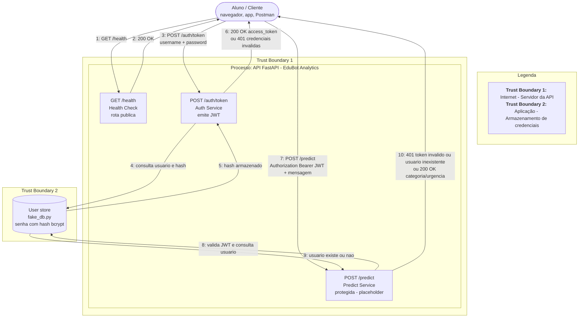

# DFD - EduBot Analytics

## Elementos do diagrama

- **Entidade externa:** Aluno / Cliente - usuário não confiável que interage com a API via HTTP.
- **Processos:** os três endpoints da API (`/health`, `/auth/token`, `/predict`).
- **Armazenamento de dados:** base de usuários (atualmente em memória, `fake_db.py`), que guarda o hash das senhas.
- **Trust boundaries:**
  1. Entre o Aluno (rede pública / Internet) e o servidor da API -> todo dado que cruza essa fronteira é tratado como não confiável até ser validado (ex: token JWT, corpo da requisição).
  2. Entre a lógica da aplicação (processos) e o armazenamento de credenciais -> separa o código que atende requisições do componente que guarda segredos.

## Diagrama

## Entradas e saídas

**Entradas da API:**

- Credenciais (`username`, `password`) em `POST /auth/token`
- Token JWT no header `Authorization: Bearer <token>` em `POST /predict`
- Corpo da requisição (`mensagem`) em `POST /predict`

**Saídas da API:**

- Status de disponibilidade em `GET /health`
- Token de acesso (JWT) em `POST /auth/token`, ou erro 401 se credenciais inválidas
- Classificação de categoria/urgência (hoje placeholder) em `POST /predict`, ou erro 401 sem token válido
