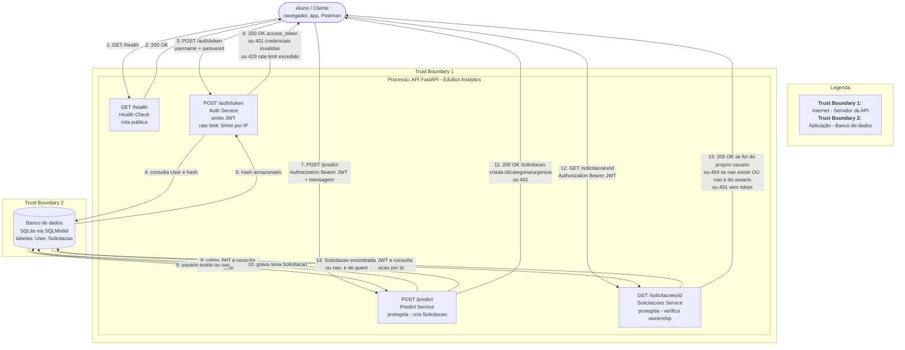

# DFD - EduBot Analytics

## Elementos do diagrama

- **Entidade externa:** Aluno / Cliente - usuário não confiável que interage com a API via HTTP.
- **Processos:** quatro rotas da API (`/health`, `/auth/token`, `/predict` e `/solicitacoes/{id}`).
- **Armazenamento de dados:** banco de dados SQLite via SQLModel, com duas tabelas, `User` (credenciais) e `Solicitacao`.
- **Trust boundaries:**
  1. Entre o Aluno (rede pública / Internet) e o servidor da API -> todo dado que cruza essa fronteira é tratado como não confiável até ser validado (ex: token JWT, corpo da requisição).
  2. Entre a lógica da aplicação (processos) e o banco de dados -> separa o código que atende requisições do componente que guarda dados persistentes.

## Diagrama

## Entradas e saídas

**Entradas da API:**

- Credenciais (`username`, `password`) em `POST /auth/token`
- Token JWT no header `Authorization: Bearer <token>` em `POST /predict` e `GET /solicitacoes/{id}`
- Corpo da requisição (`mensagem`) em `POST /predict`
- ID da solicitação (parâmetro de rota) em `GET /solicitacoes/{id}`

**Saídas da API:**

- Status de disponibilidade em `GET /health`
- Token de acesso (JWT) em `POST /auth/token`, ou erro 401 (credenciais inválidas) ou 429 (rate limit excedido)
- Solicitação criada (id, categoria, urgência) em `POST /predict`, ou erro 401 sem token válido
- Dados da solicitação em `GET /solicitacoes/{id}` (se pertencer ao usuário autenticado), ou erro 404 (ID inexistente ou pertencente a outro usuário) ou 401 sem token
