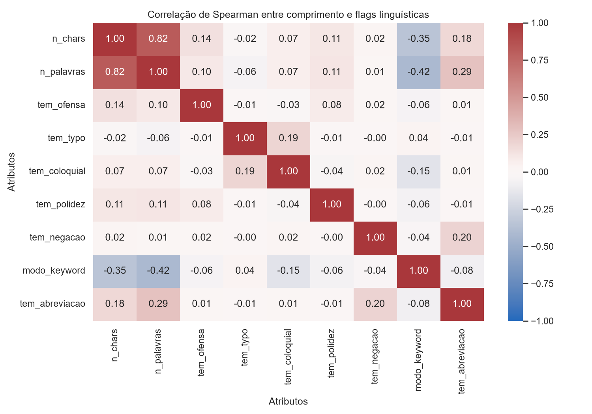
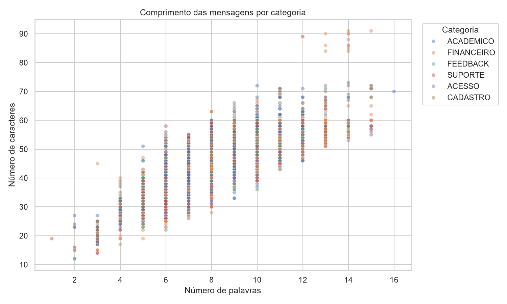
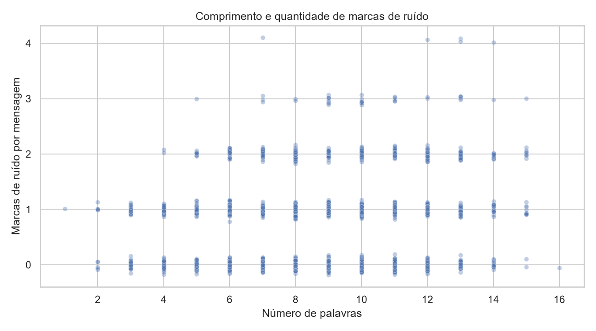

# Relatório de EDA do TP2

## Problema

A ideia do EduBot é identificar a categoria e a urgência de pedidos acadêmicos. No TP1, usei o Bitext para montar o pipeline, mas o dataset tem frases sintéticas em inglês e voltadas para e-commerce. Os rótulos foram adaptados, mas os textos continuaram iguais. Como o professor apontou, isso deixa a análise distante de situações como matrícula, trancamento e consulta de notas.

No TP2, mantive o Bitext para continuar a análise, mas acrescentei uma amostra em português e ligada ao contexto universitário. Também mudei a forma de olhar para urgência: em vez de associar urgência a hostilidade, passei a considerar prazo e impacto acadêmico.

## Dados

### Bitext tratado

- 21.006 mensagens;
- 23 intenções agrupadas em 6 categorias;
- média de 8,81 palavras por mensagem;
- 30,17% das mensagens contêm ao menos um termo simples de e-commerce usado na comparação;
- nenhuma mensagem contém os termos acadêmicos em português usados na mesma comparação.

### Amostra acadêmica

- 300 perguntas únicas do dataset `liteofspace/unb-chatbot-dpo`;
- média de 15,17 palavras por mensagem;
- 52,33% contêm ao menos um dos termos acadêmicos usados na comparação;
- nenhuma contém os termos de e-commerce usados na comparação.

A fonte não informa uma licença. Por isso, não coloquei os textos diretamente no repositório. O arquivo `data/amostra_academica_rotulada.csv` guarda apenas hashes, identificadores e rótulos, enquanto os textos ficam em cache local depois de serem baixados pelo script `preparar_amostra_academica.py`.

Esses rótulos ainda são uma primeira triagem. A revisão humana segue o processo descrito em `guia_rotulacao.md`. Até essa revisão terminar, eles não serão tratados como verdade de campo nem usados para treinar um classificador.

## Análise

### Correlações

Usei correlação de Spearman no heatmap porque estou comparando medidas de comprimento com flags binárias. Como esperado, `n_chars` e `n_palavras` têm uma relação forte. As outras correlações servem mais para ver se existem atributos redundantes do que para sugerir qualquer relação de causa e efeito.

### Scatter plots

No primeiro gráfico, comparei número de palavras e caracteres por categoria. As categorias ficam bastante sobrepostas, então só o tamanho da mensagem não é suficiente para separar as intenções.

No segundo, comparei o comprimento com a quantidade de marcas de ruído. A ideia foi ver se textos maiores acabam recebendo mais flags simplesmente porque têm mais chance de incluir typo, abreviação ou linguagem coloquial.

### Teste formal da H1

A H1 parte da ideia de que pedidos que exigem justificativa ou consulta de processo tendem a ser mais longos do que pedidos diretos. Separei os grupos de intents antes de rodar o teste, e essa divisão está registrada no notebook.

Escolhi o Mann-Whitney bicaudal porque `n_palavras` é uma variável discreta, chega no máximo a 16 no Bitext e não segue uma distribuição normal.

- pedidos diretos: 4.571 mensagens, média 8,39 e mediana 8 palavras;
- processo ou justificativa: 4.460 mensagens, média 9,24 e mediana 9 palavras;
- U = 12.057.178;
- p-valor = 1,054 × 10⁻⁵¹;
- Cliff's delta = 0,183.

Com esse p-valor, rejeito a hipótese de que os dois grupos tenham a mesma distribuição. Mesmo assim, o efeito é pequeno. Então o resultado apoia a H1 dentro do Bitext, mas a diferença de apenas uma palavra na mediana tem pouca utilidade prática para classificação. O conteúdo da mensagem continua sendo bem mais importante.

## Insights principais

1. A diferença entre os dois domínios aparece nos dados, não só na leitura dos textos. A amostra acadêmica é mais longa e usa um vocabulário que praticamente não aparece no Bitext tratado.
2. O comprimento tem alguma relação com o tipo de pedido, mas o efeito é pequeno e não dá para classificar uma mensagem só por isso.
3. Ofensa ou polidez não são bons critérios para urgência. Prazo e impacto acadêmico fazem mais sentido nesse contexto.
4. O Bitext ainda serve para testar o pipeline e estudar ruído linguístico, mas não deveria ser a única fonte de dados de um modelo futuro.

## Limitações

- O Bitext continua sendo sintético, em inglês e fora do domínio acadêmico.
- A amostra acadêmica também inclui variações geradas e não representa logs reais de atendimento.
- A fonte acadêmica não informa uma licença, então os textos não são redistribuídos no projeto.
- A amostra tem só 300 mensagens e os rótulos ainda precisam de revisão humana.
- O teste formal usa grupos montados a partir das intents adaptadas do Bitext. Por isso, não dá para assumir que o mesmo resultado vale diretamente para alunos reais.

## Próximos passos

1. Terminar a revisão humana da amostra acadêmica.
2. Se houver outra pessoa disponível, fazer uma segunda revisão de parte da amostra para medir concordância.
3. Procurar logs acadêmicos anonimizados e com licença clara.
4. Treinar um baseline de categoria só depois de separar treino, validação e teste por fonte.
5. Tratar urgência como uma tarefa separada e manter `indeterminada` quando a mensagem não trouxer informação de prazo ou impacto.

## Uso de IA

Usei o Cursor como apoio para preparar scripts, organizar o notebook, sugerir uma triagem inicial e revisar partes do texto. As estatísticas e figuras vieram da execução do código. A conferência das fontes, dos rótulos e das interpretações continua sendo minha responsabilidade.
